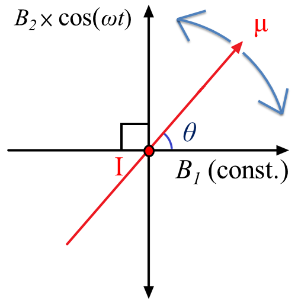
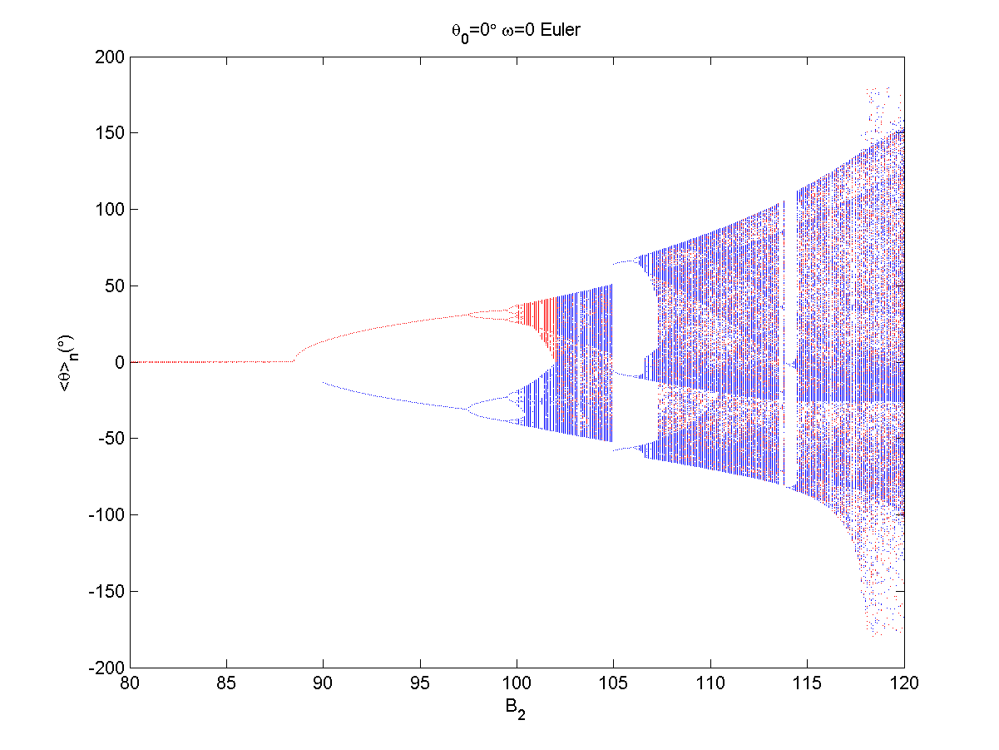
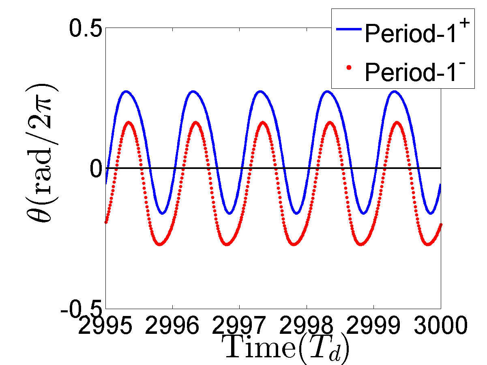
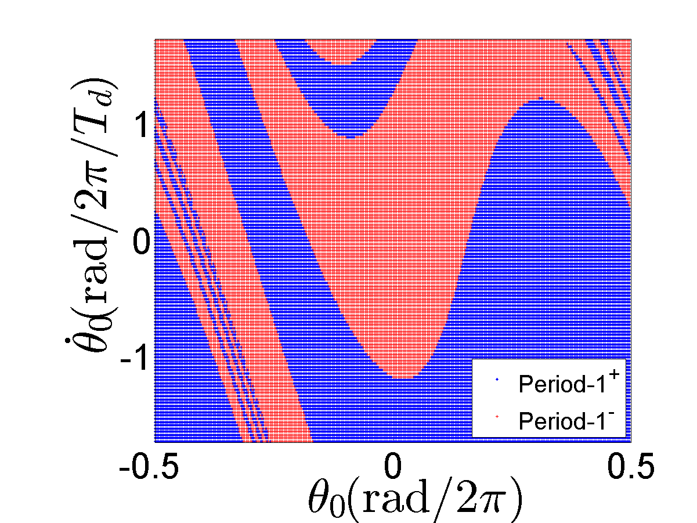

# Nonlinear Driven Damped Oscillation

## Schematic of the system

  

### Equation of motion:

$$\frac{d^2\theta}{dT^2}=-\gamma\frac{d\theta}{dT}-b_1\sin\theta+b_2\cos\theta\cos (2\pi T)$$

---

## Bifurcation diagram showing the coexistence of attractors

---

## $b_2=95.0$

### $\theta-t$ plot

---

### 2D projection of the phase space

---

### Basins of attraction

---

